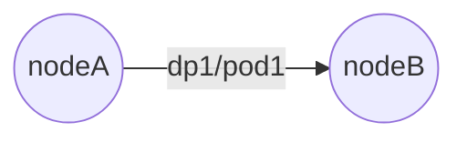
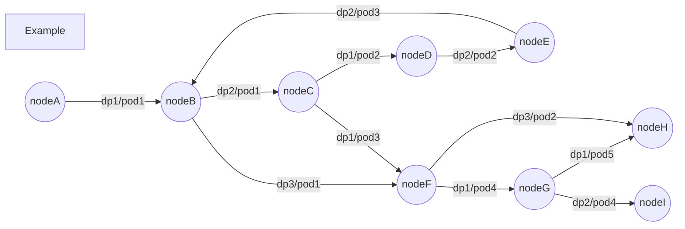
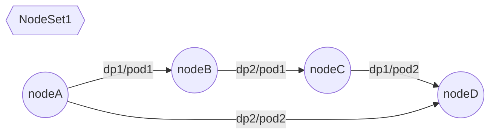
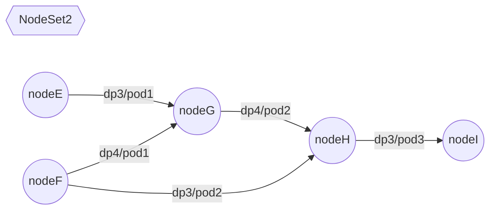
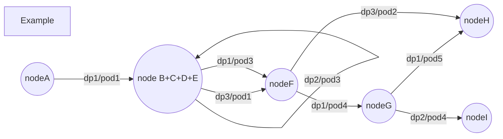

# escheduler

Edge-based-task scheduling framework for directed-graph.

## Intro

传统 $DAG$ 工作任务调度器的调度单元为点，而 $escheduler$ 的调度基本单元为边。

## Background

在调度过程中，某次调度决策对于另一调度决策的集合存在依赖关系。

### Case 1 重调度

以重调度为例，对于需要重调度的 Pod ，按照该 Pod 的移动去向构造有向边：

则对于某次重调度的调度决策，可以构造出类似下图的有向图：

分析其基本特征：

-   有向图的节点间存在顺序依赖关系
    -   如 `nodeA` 中的 `dp1/pod1` 可能必须在 `nodeB` 上的 `dp2/pod1` 与 `dp3/pod1` 被转移走之后才能够转移到 `nodeB` 上
-   有向图的节点间可能存在循环依赖
    -   如 `nodeB -> nodeC -> nodeD -> nodeE -> nodeB` ，必须在单次调度决策中完成整个有依赖的调度行为
-   应当优先处理无后继的节点

另外，在单次重调度中，我们可能会构造出多组有依赖关系的节点集合，不同集合间无依赖关系：

在这种情况下，我们需要对每一个 NodeSet 分别做调度决策的分割。

---

在有向图定义下，如果一个图的任意两个节点都可以通过有向边彼此到达，则称该图为强连通图。显然：一个有依赖关系的环满足强连通图的条件。

对于一个有向图的子图，如果其是强连通的，则称其为原图的强连通分量（SCC）。显然：环、任意单点都是强连通分量。

任意有向图都可以在对所有强连通分量执行缩点后形成一个有向无环图（DAG）。所谓缩点即将一组点看作一个点。

对前述 Example 图执行强连通分量分解后，我们将得到以下新的有向图：

>   当然，这里的样例只存在一个环，实际可能会存在环套环的情况，但仍然可以通过缩点的方式将复杂环抽象为单点。
>
>   缩点后得到的点将拥有数条自环边。

如此一来，原图将成为一个 DAG，我们可以根据新图节点间的依赖关系构造拓扑序，并根据拓扑逆序执行 Pod 转移动作。

---

在只考虑正确性的前提下，我们只需按照 SCC 分解后的新图的拓扑逆序执行 Pod 转移的调度决策即可。也即：新图中某一个点的任意一条入边即为调度决策包含的最小单元。（注意特例：缩点后得到的自环边需要整体作为一个数据单元）。

推理易知，我们需要在构造调度决策时遵循以下基本原则：

1.   如果当前没有任何可选边，直接 Fail
2.   如果当前点是缩点后的点（包含自环边），则需要将该点的所有自环边统一放入同一调度决策
     -   如果其自环边整体不满足指定的约束条件，则无法构造调度决策，直接 Fail

2.   无论当前点是缩点后的点还是未缩点的点，都可以在满足指定约束的条件下选择一部分入边甚至所有入边，将其统一放入同一个 调度决策
     -   假定对于 `nodeH` 同时选择两条入边 `dp3/pod2+dp1/pod5` 仍然不违背指定约束，则可以同时把这两个 Pod 的转移放入一个调度决策
     -   假定对于 `nodeF` 其两条入边 `dp1/pod3+dp3/pod1` 同时转移会违背指定约束（如 PDB），而单独转移其中任意一个合法，则需要将这两个 Pod 的转移分别放置在两个不同的调度决策
3.   选择的边必须是没有出边的点的入边子集
     -   没有出边的点意味着该点不存在需要向其他节点转移的 Pod，这样可以确保移动顺序合法
4.   只要满足指定约束，选择的边所对应的点可以是一个集合
     -   可以是有先后依赖关系的点集
     -   可以是无任何依赖关系的点集
     -   可以是前面两种点集的混合

在此基本原则下，无法在多项式时间复杂度内构造调度决策的边集。

但可以在一定前提条件下采取贪心策略，并借助相应的数据结构维护来实现随机数据下足够快速且相对较优的划分方案。

遵循以下贪心原则进行选取（TODO: Improve this）：

-   对每一个 NodeSet 单独按本 NodeSet 内的深度（距离 DAG 起点的最长距离）降序选取该深度所有点的自环边和入边
    -   遵循指定约束首先选取自环边（如有），其次尽可能的选取入边
    -   若约束还有剩余，则深度递减并重复执行此流程
    -   若未选取过任意点且当前深度任一入边都无法选择，有理由直接 Fail （在构造新图的过程中直接判断）
-   对不同 NodeSet 间选择的边集相互组合（仍需满足指定约束），作为一个完整的调度决策
    -   按集合大小排序后互补组合（有一定概率不是最优方案，但单个集合本身已经是最接近约束条件的，即便不能组合也没关系）

### Case 2 流式调度

TODO