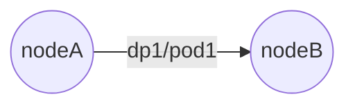
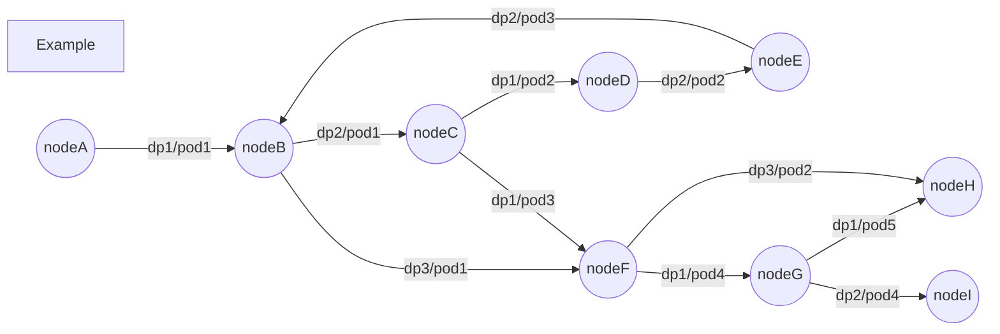
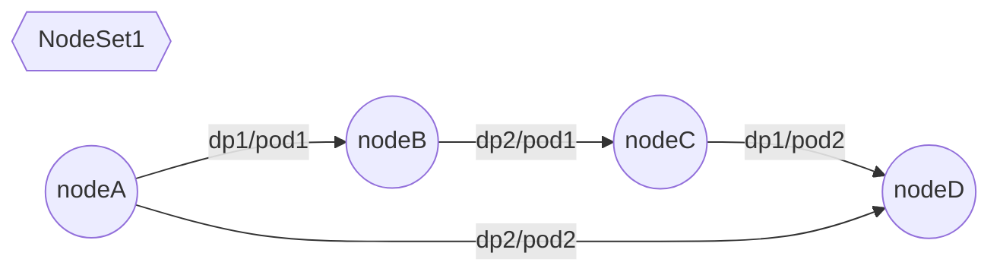
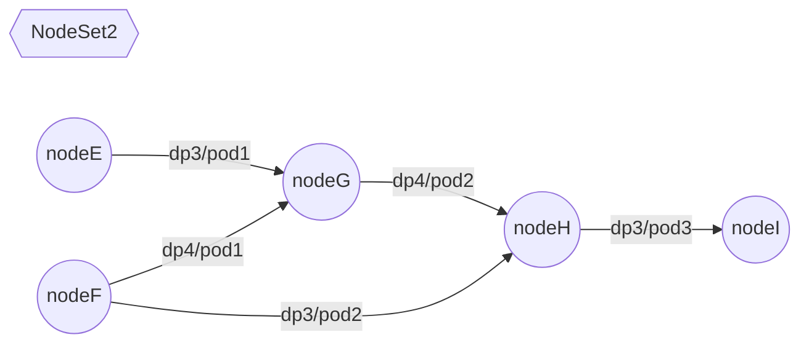
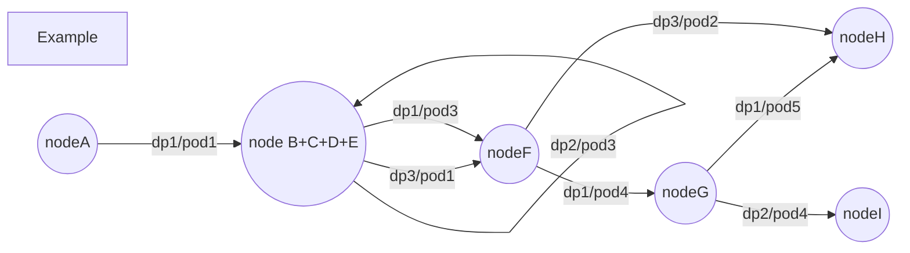

# escheduler
Edge-based-task scheduling framework for directed-graph.

## Intro

The traditional $DAG$ task scheduler has a point-based scheduling unit, while the $escheduler$ has an edge-based scheduling unit.

## Background

During scheduling, a scheduling decision has a dependency on the set of another scheduling decision.

### Case 1 Rescheduling

As an example of rescheduling, for a Pod that needs to be rescheduled, a directed edge is constructed according to the direction of movement of the Pod.

Then for a particular rescheduling scheduling decision, a directed graph similar to the following can be constructed.

Analysis of its basic features.

- There are sequential dependencies between the nodes of the directed graph
    - For example, `dp1/pod1` in `nodeA` may have to be transferred to `nodeB` only after `dp2/pod1` and `dp3/pod1` on `nodeB` have been transferred away.
- There may be circular dependencies between the nodes of the directed graph
    - such as `nodeB -> nodeC -> nodeD -> nodeE -> nodeB`, the entire dependent scheduling behavior must be completed in a single scheduling decision
- priority should be given to nodes without successors

In addition, in a single rescheduling, we may construct multiple sets of dependent node collections with no dependencies between different collections: the

In this case, we need to do the splitting of scheduling decisions separately for each NodeSet.

---

Under the definition of directed graph, a graph is said to be strongly connected if any two nodes of the graph are reachable to each other by directed edges. Clearly: a ring with dependencies satisfies the condition of a strongly connected graph.

A subgraph of a directed graph is said to be a strongly connected component (SCC) of the original graph if it is strongly connected. Obviously: a ring, any single point is a strongly connected component.

Any directed graph can form a directed acyclic graph (DAG) after performing a point reduction on all strongly connected components. The so-called reduction point is a set of points considered as one point.

After performing the strong connected component decomposition of the Example graph, we will get the following new directed graph.

> Of course, only one ring exists in the sample here, and there may actually be a ring-over-ring situation, but it is still possible to abstract a complex ring to a single point by shrinking the points.
>
> The point obtained after the point reduction will have several self-loop edges.

In this way, the original graph will become a DAG, and we can construct the topological order according to the dependencies between the nodes of the new graph, and perform Pod transfer actions according to the topological inverse order.

---

Under the premise of correctness only, we only need to execute the scheduling decision of Pod transfer according to the topological inverse order of the new graph after SCC decomposition. That is, any incoming edge of a point in the new graph is the smallest unit contained in scheduling dicision. (Note the exception: the self-looping edge obtained after the point reduction needs to be treated as a data unit as a whole).

It is easy to deduce that we need to follow the following basic principles when constructing the scheduling decision.

1. if there is no optional edge at the current point, Fail directly
2. If the current point is a point after reduction (including self-looping edges), all self-looping edges of the point need to be put into the same scheduling decision uniformly
     - If the whole self-looping edge does not satisfy the specified constraint, the scheduling decision cannot be constructed and fails directly.

2. Whether the current point is a scaled point or an unscaled point, you can select some of the incoming edges or even all of the incoming edges and put them into the same scheduling decision if the specified constraints are satisfied.
     - Assuming that for `nodeH` two incoming edges `dp3/pod2+dp1/pod5` are selected at the same time and still do not violate the specified constraint, the transfer of both Pods can be put into one scheduling decision
     - Assume that for `nodeF`, two incoming edges `dp1/pod3+dp3/pod1` would violate the specified constraint (e.g., PDB), and it is legal to transfer either one of them separately, then the transfer of both Pods should be placed in two different scheduling decisions.
3. the selected edges must be a subset of the incoming edges of the points without outgoing edges
     - A point with no outgoing edges means that there are no Pods at that point that need to be transferred to other nodes, which ensures that the order of movement is legal
4. the points corresponding to the selected edge can be a set as long as the specified constraint is satisfied
     - It can be a set of points with sequential dependencies
     - It can be a set of points without any dependencies
     - It can be a mixture of the previous two point sets

Under this basic principle, it is not possible to construct the set of edges for scheduling decisions within polynomial time complexity.

However, it is possible to adopt a greedy strategy under certain preconditions and to achieve a sufficiently fast and relatively optimal partitioning scheme under random data with the help of corresponding data structure maintenance.

The following greedy principle is followed for selection (TODO: Improve this).

- For each NodeSet individually, the self-loop edges and incoming edges of all points at that depth are selected in descending order by the depth (longest distance from the start of the DAG) within the NodeSet.
    - The self-looping edges (if any) are selected first, followed by the incoming edges as much as possible, following the specified constraints
    - If there are constraints left, the process is repeated with decreasing depth
    - If no point has been selected and no incoming edge can be selected at the current depth, there is a reason to fail (determined directly during the construction of the new graph)
- Combine selected sets of edges from different NodeSet with each other (still need to satisfy specified constraints) as a complete scheduling decision
    - Complementary combination after sorting by set size (there is a certain probability that it is not the optimal solution, but the individual sets themselves are already the closest to the constraints, so it does not matter if they cannot be combined)

### Case 2 Streaming scheduling

TODO
